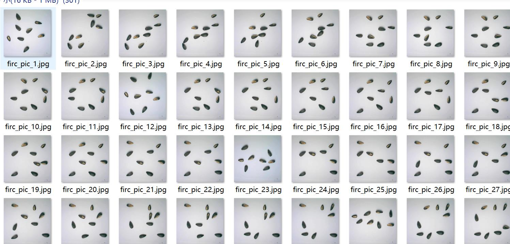
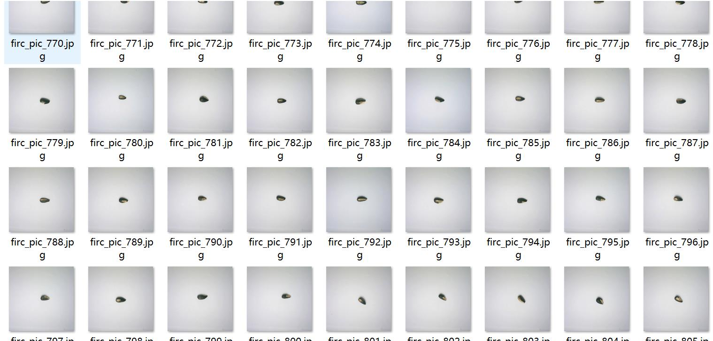
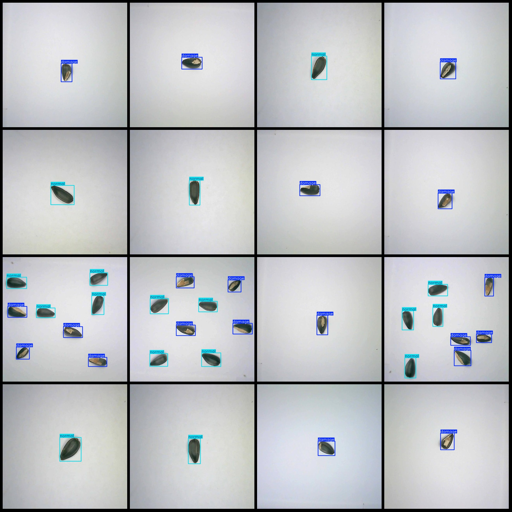
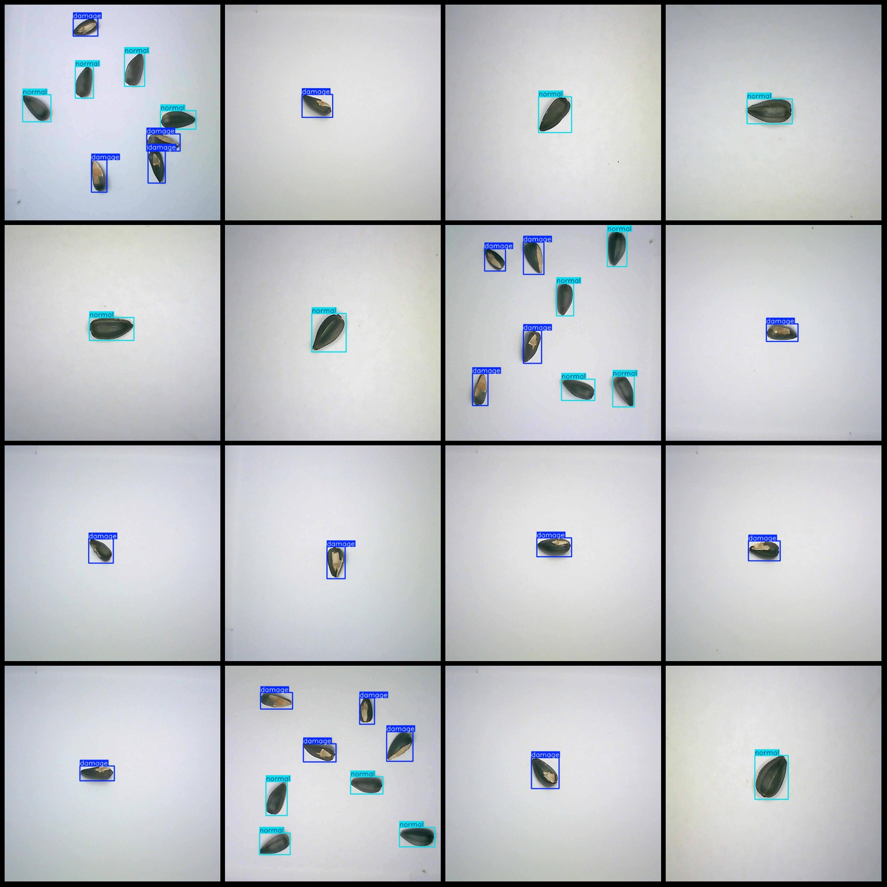

# Cucumber Seed Quality Detection - VOC+YOLO Format with 1000 Images in 2 Categories

The dataset format is Pascal VOC format + YOLO format (without the segmentation path, only contains jpg images and corresponding VOC format xml file and yolo format txt files).

- Number of images (jpg file count): 1000
- Number of annotations (xml file count): 1000
- Number of annotations (txt file count): 1000
- Number of annotation categories: 2
- Number of annotation category names (note that the order of classes in the yolo format may not correspond to this, refer to the "labels" folder for the classes.txt): ["damage", "normal"]

The number of boxes per category:
- damage = 1213
- normal = 1203
- Total boxes = 2416

Number of images per category:
- damage: 600 images
- normal: 600 images
- image resolution: 640x640

Using the labeling tool: labelImg

Annotation rules: Draw a rectangle around the category.

Important notes: The dataset should not be divided into training, validation, and test sets.

Special Notice: This dataset does not guarantee the accuracy of the trained model or weight files.

Preview of the image:
## Image

Here is a pay link on Stripe ( https://buy.stripe.com/3cs8yP7sY87d0vu9AB ). Please contact me lonlonago@foxmail.com after funding $89, and I will send you a complete data files , thank you!

